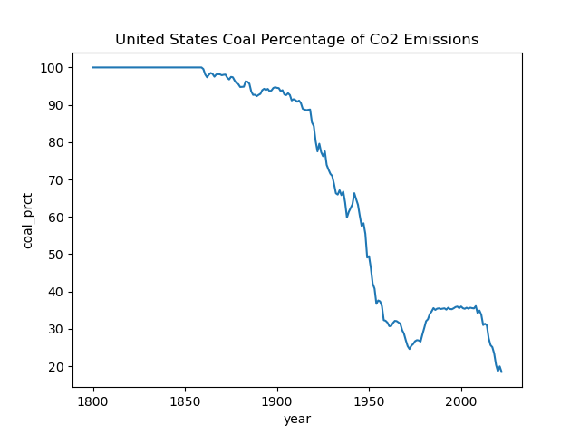
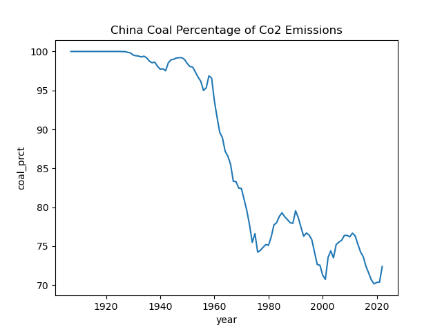
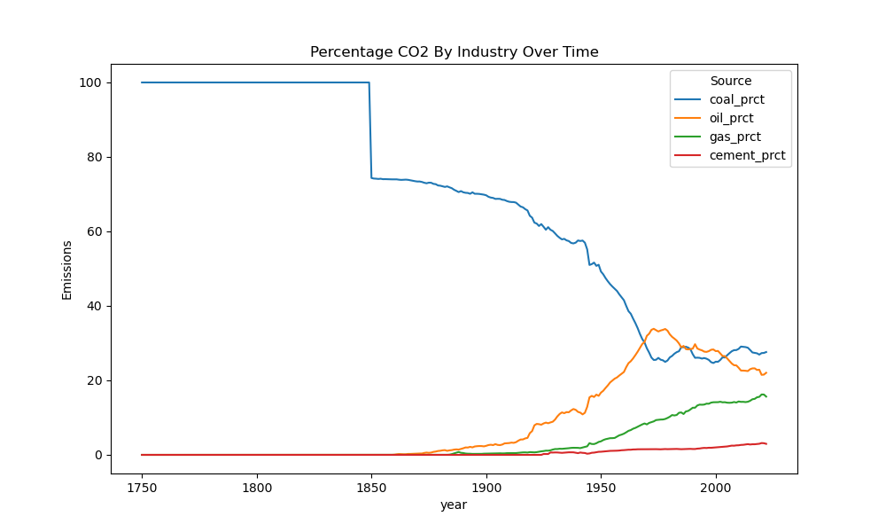
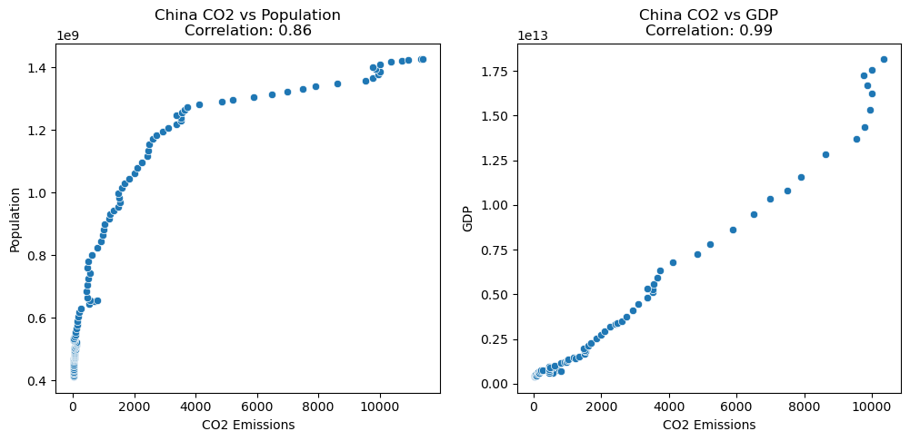
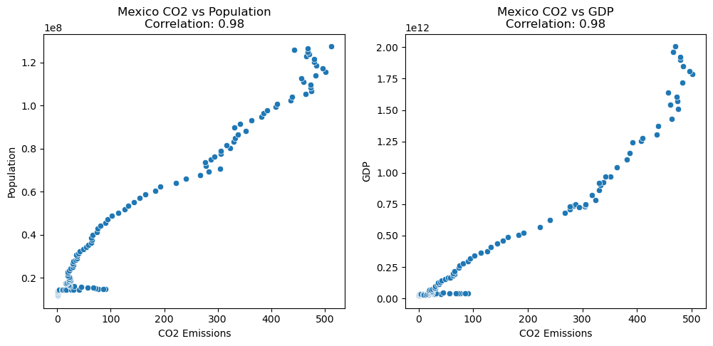
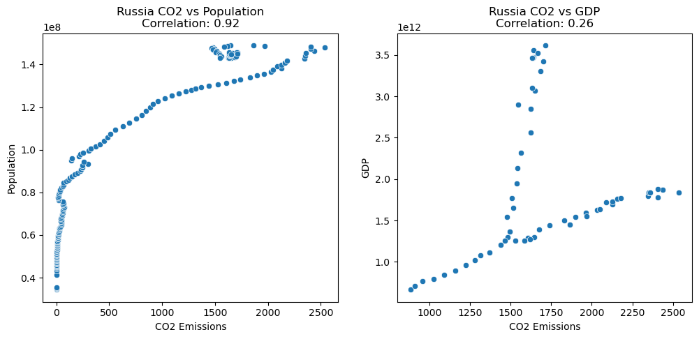

# Global CO2 Fossil Fuel Emissions
**Exploration of countries and territories and their contribution to global co2 fossil fuel emissions**
## SQL/Postgresql

## Python/Jupyter Notebook

### What countries have produced the most CO2 overtime?

- The United States emerges as the largest contributor to cumulative CO2 levels, leading significantly ahead of other nations. China, although also a major emitter, follows at a considerable distance. This stark contrast highlights the historical impact of industrial activities in the United States on global CO2 emissions.

| Country        |      CO2 Emissions |
|:---------------|--------------------:|
| United States  |         426914.556  |
| China          |         260619.243  |
| Russia         |         119290.814  |
| Germany        |          93985.871  |
| United Kingdom |          78834.706  |
| Japan          |          67734.911  |
| India          |          59740.694  |
| France         |          39397.693  |
| Canada         |          34613.228  |
| Ukraine        |          30961.508  |

### What years was the most CO2 produced?

- The top 10 years span from 2012 to 2022, with a notable absence of 2020. This missing year likely reflects the global reduction in industrial activity and transportation due to the COVID-19 pandemic. The following data highlight the years with the highest emissions, providing insights into the recent trends in global CO2 production.

| Year |        CO2 |   Coal CO2 |    Oil CO2 |    Gas CO2 | Cement CO2 |
|:-----|-----------:|-----------:|-----------:|-----------:|-----------:|
| 2022 | 237679.814 |  65615.326 |  52381.960 |  37194.995 |   7033.475 |
| 2019 | 236804.780 |  63757.935 |  54128.837 |  36884.891 |   7054.495 |
| 2021 | 236484.697 |  64734.981 |  50954.326 |  38299.411 |   7396.027 |
| 2018 | 235455.960 |  64199.107 |  53688.346 |  36409.482 |   6852.412 |
| 2017 | 231066.766 |  63263.172 |  53671.953 |  34742.105 |   6590.551 |
| 2016 | 227618.087 |  62590.770 |  52852.505 |  33991.622 |   6489.787 |
| 2015 | 227612.884 |  64096.988 |  52357.459 |  33055.487 |   6324.818 |
| 2014 | 227582.200 |  65481.224 |  51206.221 |  32448.060 |   6552.658 |
| 2013 | 226555.346 |  65565.896 |  51159.331 |  32106.497 |   6313.215 |
| 2012 | 225160.414 |  65333.733 |  50952.808 |  32064.065 |   6068.376 |

### What percentage of fossil fuel CO2 is each industry(coal, oil, gas, cement) responsible for? How has it changed over time?

- Starting from the year 1750, coal was responsible for 100% of CO2 emissions. Over the centuries, the contributions from oil, gas, and cement have increased, leading to a more diverse industrial impact on CO2 levels. By 2022, the reliance on coal has decreased significantly, with its share of CO2 emissions dropping by 73%. The following data and visualizations illustrate these changes, highlighting the evolving sources of CO2 emissions over time.

### How has coal production changed over time?

- Overall, countries have significantly reduced their coal production. However, the two largest CO2 producers show markedly different trends.  The following plots illustrate these differences.

### What are the per capita fossil fuel emisssions by country?

- Despite being one of the largest CO2 producers due to its massive population, China's per capita CO2 emissions stand at 7.99 tons, placing it only in the middle of the pack. Qatar leads with a staggering 37.60 tons per capita, while countries like Australia, Canada, and the United States all have per capita emissions that are at least double that of China.

| Year | Country       | CO2 per Capita (t) |
|------|---------------|--------------------|
| 2022 | Qatar         | 37.60              |
| 2022 | Australia     | 14.99              |
| 2022 | United States | 14.95              |
| 2022 | Canada        | 14.25              |
| 2022 | China         | 7.99               |

### Is there a correlation between CO2 emissions from fossil fuels and a country's GDP or population?

- When examining the total CO2 emissions of all countries combined in relation to GDP and population, GDP shows a much stronger correlation than population. 

- However, when analyzing the correlation on a country-by-country basis, the results vary significantly. For instance, in Canada, the correlation between GDP and CO2 emissions is quite similar to that between population and CO2 emissions. In contrast, China shows a slight deviation between the two correlations. Notably, Russia exhibits a substantial disparity, with a GDP-CO2 correlation of 0.26 and a population-CO2 correlation of 0.92. This large difference could indicate a data inconsistency or other environmental factors specific to Russia

