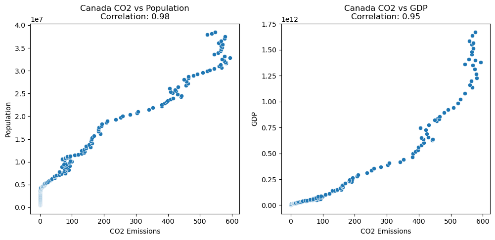

# Global CO2 Fossil Fuel Emissions
**Exploration of countries and territories and their contribution to global co2 fossil fuel emissions**

This project entails an exploration of global CO2 emissions from fossil fuels, focusing on the historical and temporal changes in fossil fuel usage. The analysis will be conducted using SQL (PostgreSQL) and Python (Pandas) for data exploration, while data visualization will be performed using Python and Tableau.

The dataset used was cultivated by [Our World In Data](https://ourworldindata.org/) and can be found [here](https://github.com/owid/co2-data?tab=readme-ov-file).

## SQL/Postgresql

- Skills used: Joins, CTE's, Case Statements, Window Functions, Aggregate Functions, Creating Views, Converting Data Types

### Select and display all the data that will be used
```sql
SELECT 
    ci.country, 
    ci.year, 
	ci.population, 
	ci.gdp, 
	co.cement_mt, 
	co.co2_mt, 
	co.coal_mt, 
	co.gas_mt, 
	co.oil_mt
FROM country_info ci
    JOIN co2 co
    ON ci.id = co.ci_id;
```

### Creating a View of the combined data, including only current countries and no null co2 data
```sql
CREATE VIEW current_countries AS
SELECT 
    ci.country, 
	ci.year, 
	ci.population, 
	ci.gdp, 
	co.cement_mt, 
	co.co2_mt, 
	co.coal_mt, 
	co.gas_mt, 
	co.oil_mt
FROM country_info AS ci
JOIN co2 AS co
    ON ci.id = co.ci_id
WHERE country NOT IN('World', 'Africa', 'South America') 
    AND country NOT LIKE '%countries%'
    AND country NOT LIKE '%GCP%'
	AND country NOT LIKE '%International%'
	AND country NOT LIKE '%Asia%'
	AND country NOT LIKE '%Europe%'
	AND country NOT LIKE 'North America%'
	AND co.co2_mt IS NOT NULL
	AND co.coal_mt IS NOT NULL
	AND co.gas_mt IS NOT NULL
	AND co.oil_mt IS NOT NULL
	AND co.cement_mt IS NOT NULL;
```

### Select and display total cumulative co2 levels
```sql
SELECT 
    country, 
	ROUND(SUM(co2_mt)) as cumulative_co2
FROM current_countries
GROUP BY country
HAVING SUM(co2_mt) IS NOT NULL
ORDER BY cumulative_co2 DESC
LIMIT 10;
```

### SELECT and display co2 per capita levels for Canada in metric tonnes
```sql
SELECT 
    country, 
	year, 
	ROUND(CAST(co2_mt/population*1000000 AS numeric),2) AS per_capita_co2
FROM current_countries
WHERE country = 'Canada';
```

### Calculate and display percentage change in per capita year over year
```sql
WITH per_capita AS(
SELECT 
    country, 
	year, 
	ROUND(CAST(co2_mt/population*1000000 AS numeric),2) AS per_capita_co2
FROM current_countries
)
, per_capita_lag AS (
SELECT 
	country, 
	year, 
	per_capita_co2,
	LAG(per_capita_co2) OVER (PARTITION BY country ORDER BY year) AS prev_per_capita
FROM per_capita
)
SELECT 
    country, 
	year, 
	per_capita_co2, 
	CASE
	    WHEN prev_per_capita IS NULL THEN NULL
		ELSE ROUND((per_capita_co2 - prev_per_capita) / prev_per_capita * 100)
	END AS pct_change
FROM per_capita_lag
WHERE year = 2020
ORDER BY pct_change;
```

### Calculate and display the percentage of coal, oil, gas and cement CO2 emissions in total cumulative CO2 emissions by year
```sql
SELECT 
    year, 
    ROUND(CAST(SUM(co2_mt) AS numeric), 2) AS total_co2, 
    ROUND(CAST(SUM(coal_mt)/SUM(co2_mt) AS numeric) * 100, 2) AS coal_percentage,
	ROUND(CAST(SUM(gas_mt)/SUM(co2_mt) AS numeric) * 100, 2) AS gas_percentage,
	ROUND(CAST(SUM(oil_mt)/SUM(co2_mt) AS numeric) * 100, 2) AS oil_percentage,
	ROUND(CAST(SUM(cement_mt)/SUM(co2_mt) AS numeric) * 100, 2) AS cement_percentage
FROM current_countries
GROUP BY year
ORDER BY year;
```

### Calculate and display the percentage of coal, oil, gas and cement CO2 emissions in total cumulative CO2 emissions by country
```sql
SELECT 
    country,
	ROUND(CAST(SUM(co2_mt) AS numeric), 2) AS total_co2, 
    ROUND(CAST(SUM(coal_mt)/SUM(co2_mt) AS numeric) * 100, 2) AS coal_percentage,
	ROUND(CAST(SUM(gas_mt)/SUM(co2_mt) AS numeric) * 100, 2) AS gas_percentage,
	ROUND(CAST(SUM(oil_mt)/SUM(co2_mt) AS numeric) * 100, 2) AS oil_percentage,
	ROUND(CAST(SUM(cement_mt)/SUM(co2_mt) AS numeric) * 100, 2) AS cement_percentage
FROM current_countries
GROUP BY country
ORDER BY total_co2 DESC;
```

### Calculate and display the total historic co2 emissions and the percentage of that total ordered by top 10 countries
```sql
WITH total_co2 AS(
SELECT 
	ROUND(SUM(co2_mt)*1000000) AS total_co2
FROM current_countries
)

SELECT 
    country, 
	ROUND(SUM(cc.co2_mt)) AS total_co2_mt,
    ROUND(SUM(cc.co2_mt*1000000/tc.total_co2 * 100)) AS percentage
FROM current_countries cc
CROSS JOIN total_co2 tc
GROUP BY country
ORDER BY percentage DESC
LIMIT 10;
```

### Calculate and display year over year percentage change of gdp, population and co2 within a country
```sql
WITH lag_data AS (
SELECT 
    year, 
	country,
	gdp,
	population,
	co2_mt,
	LAG(gdp) OVER (PARTITION BY country ORDER BY year) AS prev_gdp,
	LAG(co2_mt) OVER (PARTITION BY country ORDER BY year) AS prev_co2,
	LAG(population) OVER (PARTITION BY country ORDER BY year) AS prev_pop
FROM current_countries
)
SELECT 
    year, 
	country,
	gdp,
	CASE
	    WHEN prev_gdp != 0
		THEN ROUND((gdp - prev_gdp)/prev_gdp * 100)
		ELSE NULL
	END AS gdp_pct_change,
	co2_mt,
	CASE
	    WHEN prev_co2 != 0
		THEN ROUND((co2_mt - prev_co2)/prev_co2 * 100)
		ELSE NULL
	END AS co2_pct_change,
	population,
	CASE
	    WHEN prev_pop != 0
		THEN ROUND((population - prev_pop)/prev_pop * 100)
		ELSE NULL
	END AS pop_pct_change
FROM lag_data
WHERE country = 'Canada';
```


## Python/Jupyter Notebook

### What countries have produced the most CO2 overtime?

- The United States emerges as the largest contributor to cumulative CO2 levels, leading significantly ahead of other nations. China, although also a major emitter, follows at a considerable distance. This stark contrast highlights the historical impact of industrial activities in the United States on global CO2 emissions.

| Country        |      CO2 Emissions |
|:---------------|--------------------:|
| United States  |         426914.556  |
| China          |         260619.243  |
| Russia         |         119290.814  |
| Germany        |          93985.871  |
| United Kingdom |          78834.706  |
| Japan          |          67734.911  |
| India          |          59740.694  |
| France         |          39397.693  |
| Canada         |          34613.228  |
| Ukraine        |          30961.508  |


### What years was the most CO2 produced?

- The top 10 years span from 2012 to 2022, with a notable absence of 2020. This missing year likely reflects the global reduction in industrial activity and transportation due to the COVID-19 pandemic. The following data highlight the years with the highest emissions, providing insights into the recent trends in global CO2 production.

| Year |        CO2 |   Coal CO2 |    Oil CO2 |    Gas CO2 | Cement CO2 |
|:-----|-----------:|-----------:|-----------:|-----------:|-----------:|
| 2022 | 237679.814 |  65615.326 |  52381.960 |  37194.995 |   7033.475 |
| 2019 | 236804.780 |  63757.935 |  54128.837 |  36884.891 |   7054.495 |
| 2021 | 236484.697 |  64734.981 |  50954.326 |  38299.411 |   7396.027 |
| 2018 | 235455.960 |  64199.107 |  53688.346 |  36409.482 |   6852.412 |
| 2017 | 231066.766 |  63263.172 |  53671.953 |  34742.105 |   6590.551 |
| 2016 | 227618.087 |  62590.770 |  52852.505 |  33991.622 |   6489.787 |
| 2015 | 227612.884 |  64096.988 |  52357.459 |  33055.487 |   6324.818 |
| 2014 | 227582.200 |  65481.224 |  51206.221 |  32448.060 |   6552.658 |
| 2013 | 226555.346 |  65565.896 |  51159.331 |  32106.497 |   6313.215 |
| 2012 | 225160.414 |  65333.733 |  50952.808 |  32064.065 |   6068.376 |

### How has fossil fuel emmisions changed over time?

- Despite the growing contributions of other energy sources to overall CO2 levels, fossil fuel emissions have continued to rise over time. Among fossil fuels, coal remains the leading contributor to CO2 emissions.


### What percentage of fossil fuel CO2 is each industry(coal, oil, gas, cement) responsible for? How has it changed over time?

- Starting from the year 1750, coal was responsible for 100% of CO2 emissions. Over the centuries, the contributions from oil, gas, and cement have increased, leading to a more diverse industrial impact on CO2 levels. By 2022, the reliance on coal has decreased significantly, with its share of CO2 emissions dropping by 73%. The following data and visualizations illustrate these changes, highlighting the evolving sources of CO2 emissions over time.


### What are the per capita fossil fuel emisssions by country?

- Despite being one of the largest CO2 producers due to its massive population, China's per capita CO2 emissions stand at 7.99 tons, placing it only in the middle of the pack. Qatar leads with a staggering 37.60 tons per capita, while countries like Australia, Canada, and the United States all have per capita emissions that are at least double that of China.

| Year | Country       | CO2 per Capita (t) |
|------|---------------|--------------------|
| 2022 | Qatar         | 37.60              |
| 2022 | Australia     | 14.99              |
| 2022 | United States | 14.95              |
| 2022 | Canada        | 14.25              |
| 2022 | China         | 7.99               |


### Is there a correlation between CO2 emissions from fossil fuels and a country's GDP or population?

- When examining the total CO2 emissions of all countries combined in relation to GDP and population, GDP shows a much stronger correlation than population. 


- However, when analyzing the correlation on a country-by-country basis, the results vary significantly. For instance, in Canada, the correlation between GDP and CO2 emissions is quite similar to that between population and CO2 emissions. In contrast, China shows a slight deviation between the two correlations. Notably, Russia exhibits a substantial disparity, with a GDP-CO2 correlation of 0.26 and a population-CO2 correlation of 0.92. This large difference could indicate a data inconsistency or other environmental factors specific to Russia




## Tableau Visualizations


